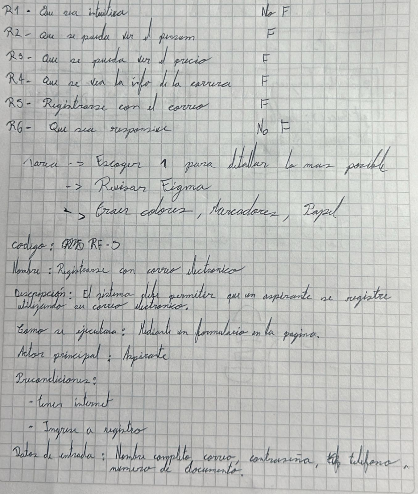
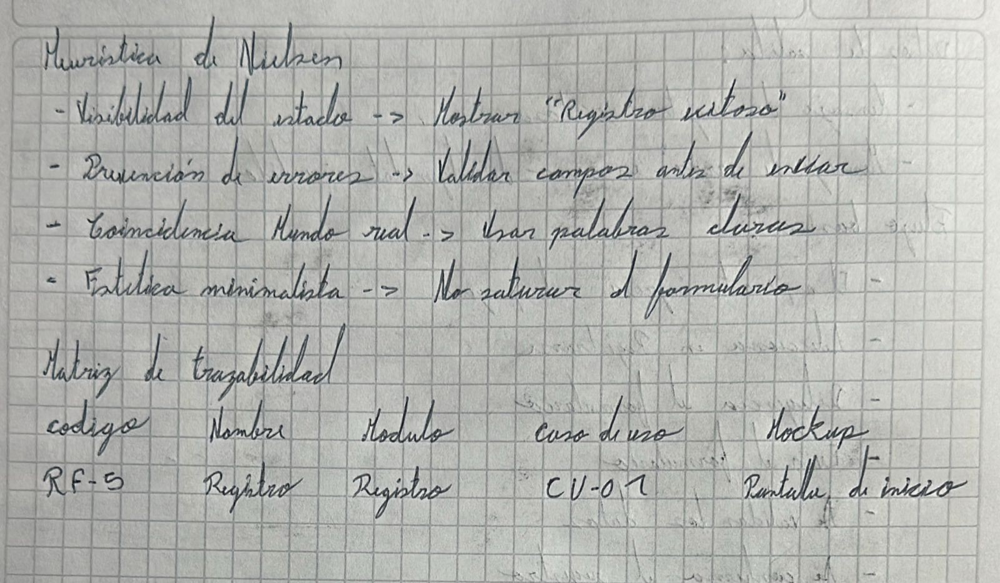

# Ejercicio análisis de requerimientos para la pagina de la escuela - formulario de inscripción a la carrera

Deben tener  el requerimiento detallado:
Nombre
Descripcion
Como se ejecutara
Actor Principal
Precondiciones
Datos de entrada y de salida
Flujo Basico
Flujo Alterno (Error)
Diagrama de casos de Uso
Reglas de negocio

