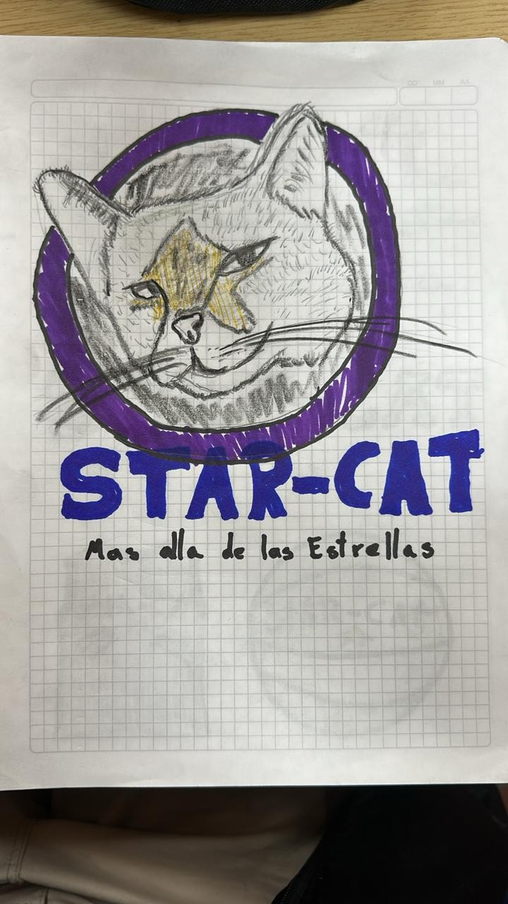
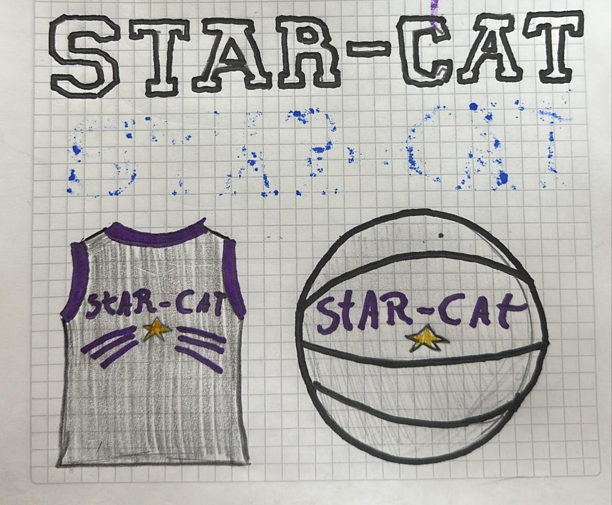

# Ejercicio en clase logo

## Nombre y slogan del prodeucto

Nombre: STAR-CAT
Slogan: Mas alla de las estrellas

## Publico Objetivo

Atletas profecionales de baloncesto (FIBA, NBA, etc)

## Paleta de colores

Azul: Conocido por reducir el estrés y la ansiedad, es ideal para mejorar la concentración, estabilidad mental y calma durante el ejercicio, siendo común en deportes de precisión.
Negro: Representa fuerza, disciplina y poder.
Amarillo: Asocia la felicidad con la alta energía, funcionando como un motivador visual que aporta confianza y positividad durante entrenamientos intensos.
Morado: e asocia con la recuperación, renovación y sanación, además de añadir un toque de sofisticación y creatividad al look deportivo. 

Juntos crean  un equililibrio entre satisfaccion, confianza y energia vibrante. (Ademas son mis colores favoritos)

## Tipografia

La tipografia utilizada es Varsity, ya que es ideal para estilos deportivos, gracias su diseño audaz, cuadrado y de bloques, diseñado para ser altamente legible a distancia en camisetas, chaquetas universitarias y equipamiento deportivo

## Imagenes Utilizadas

Estilo de jersey y estilo de balon 

## Figuras utilizadas en el diseño

Estrella
Bigotes
Nombre con tipo font Varsity

