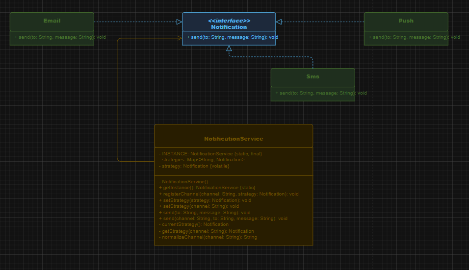
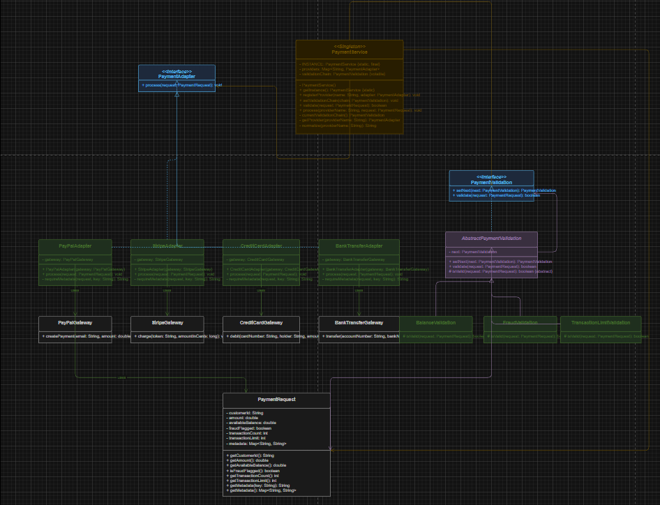
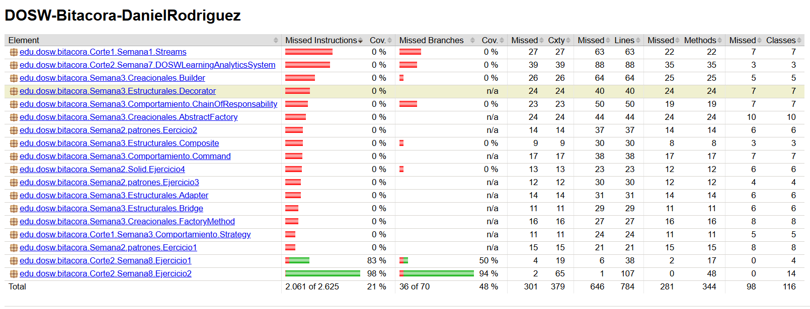

Bitácora de Aprendizaje — Semana 8
---

## Actividades realizadas

- Realizacion Ejercicio 1 de la semana
- Realizacion ejercicio 2 de la semana

## Dificultades

- Organizacion de jira, ya que aun me cuesta trabajo entender algunas funciones.
- Realizacion de algunos ejercicios.
- 

## Tiempo

Tiempo estimado en la realizacion de los ejercicios de esta semana: 10 h
Tiempo total: 10 h aproximadamente.

## Reflexion

La gestion de tiempo de esta semana, de manera general no fue la mas adecuada, pero tampoco fue mala, intente realizar las tareas mas faciles primero para las que me tomaran mas tiempo las pudiese hacer con mas calma.
Si tuviera que calificar la gestion de tiempo de esta semana entre 1-10 de manera general, no solo por DOSW daria un 7/10.

## Evidencias

Resolucion ejercicios 1 y 2 de la semana 8

---

### Ejercicio 1: Sistema de Notificaciones

1. Patrones de diseño utilizados:

    a. Nombre de los patrones: **Singleton** y **Strategy**.

    b. Tipo de los patrones: **creacional** para `Singleton` y **comportamental** para `Strategy`.

    c. Justificación técnica: `NotificationService` funciona como una única instancia centralizada para gestionar el envío de notificaciones y evitar múltiples servicios en el sistema. A su vez, `Notification` permite cambiar dinámicamente el canal de envío entre `Email`, `Sms` y `Push` sin modificar el código principal, lo que facilita agregar nuevos canales en el futuro.

2. Diagrama de clases:

3. Solucion de codigo: (hecho)

4. Pruebas unitarias: (hecho)

---

### Ejercicio 2: Sistema de Procesamiento de Pagos

1. Patrones de diseño utilizados:

    a. Nombre de los patrones: **Adapter** y **Chain of Responsibility**.

    b. Tipo de los patrones: **estructural** para `Adapter` y **comportamental** para `Chain of Responsibility`.

    c. Justificación técnica: El patrón `Adapter` permite integrar proveedores de pago con interfaces diferentes al sistema interno sin modificar el código principal, facilitando la adición de nuevos proveedores en el futuro. El patrón `Chain of Responsibility` permite ejecutar una serie de validaciones configurables en cadena, donde cada validación decide si el proceso continúa o no, lo que hace que el sistema sea flexible y fácil de mantener.

2. Diagrama de clases:

3. Solucion de codigo: (hecho)

4. Pruebas unitarias: (hecho)

---

### Cobertura Jacoco

### Analisis estatico SonarQube

El análisis estático de la semana 8 muestra una solución clara y bien estructurada. En general, los ejercicios aplican patrones de diseño adecuados y separan responsabilidades de forma correcta, aunque todavía hay algunos puntos mejorables que una herramienta como SonarQube señalaría.

#### Ejercicio 1: Sistema de Notificaciones

- **Fortalezas**: `NotificationService` centraliza el envío y mantiene una única instancia, mientras que `Notification` permite cambiar el canal entre `Email`, `Sms` y `Push` sin modificar el núcleo.
- **Observaciones**: el uso de un singleton con estado mutable puede complicar pruebas más avanzadas o escenarios concurrentes. También sería recomendable reemplazar la salida directa por consola por una estrategia de logging si el sistema creciera.
- **Conclusión**: la solución es flexible y extensible, porque permite agregar nuevos canales con poco impacto en el código existente.

#### Ejercicio 2: Sistema de Procesamiento de Pagos

- **Fortalezas**: `PaymentService` separa el flujo principal de los proveedores externos y de las validaciones, lo que mejora la mantenibilidad.
- **Observaciones**: usar `double` para montos financieros puede generar problemas de precisión; en un sistema real sería mejor `BigDecimal`. Además, el singleton también mantiene estado mutable, aunque está controlado por registro de proveedores y cadena de validación.
- **Conclusión**: la solución es correcta y extensible, ya que permite sumar proveedores y validaciones sin modificar la lógica principal.

#### Resultado general

El análisis estático no evidencia problemas graves de diseño. Los principales puntos de mejora son el manejo de estado global en los singletons, el uso de `double` en pagos y el uso de consola para mostrar resultados. Aun así, la implementación cumple bien con los objetivos de ambos ejercicios y demuestra una correcta aplicación de patrones de diseño.

